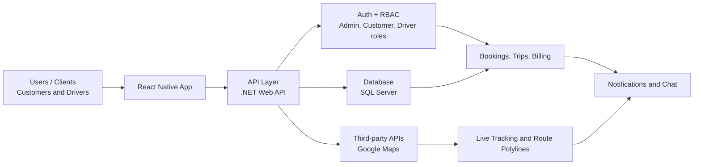
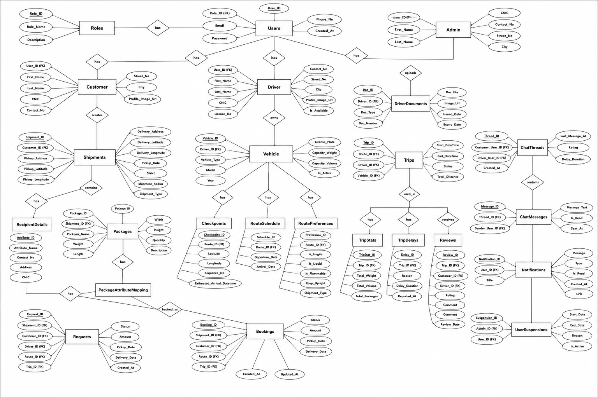

# Api_cargo — Logistics & Truck Booking Platform (Backend API)

A logistics platform that automates truck booking and real-time shipment management — built as a final-year engineering project. This repository contains the **.NET backend API** that powers the mobile app.

---

## 📱 System Overview

| Layer | Tech |
|---|---|
| Frontend | React Native ([CargoConnect](https://github.com/Saqibali2/CargoConnect)) |
| Backend (this repo) | .NET Web API (ASP.NET, C#) |
| Database | SQL Server — Entity Framework **Database-First** |
| Maps | Google Maps API |

**Overall system architecture:** Client-Server (3-Tier)
```
Presentation Tier   → React Native (Screens + Context + Services)
Application Tier    → ASP.NET Web API (Controllers + Models)  ← this repo
Data Tier           → SQL Server (EF Database-First, via .edmx)
```

**Backend internal architecture:** Controller-Model (2-layer). Controllers talk to the database through EF-generated models directly — there is no separate Repository/Service layer in this version.

The platform connects **customers** who need shipments moved with **drivers** who have available truck capacity — matching routes, tracking trucks live on a map, and handling the full flow from booking to billing to review.

---

## ✨ Key Features

- **Live tracking** — real-time truck positions with drawn route polylines on the map
- **Instant booking** — automated dispatch matches a shipment to an available driver/vehicle
- **Shared truck-space allocation** — multiple shipments can share space on a route (route matching / pooling), instead of requiring one truck per booking
- **Driver & vehicle management** — driver documents, verification, vehicle capacity/type tracking
- **Booking-to-billing flow** — from request → booking → trip → billing
- **In-app chat** — threaded messaging between customer and driver per trip
- **Notifications** — booking/trip status updates
- **Reviews & ratings** — post-trip feedback system
- **Trip analytics** — trip stats and delay tracking/reasons

---

## 🧭 Engineering Map



---

## 🗂️ Database Design (ERD)



Core entity groups:

- **Identity & Access**: `Roles`, `Users`, `Admin`, `Customer`, `Driver`
- **Fleet**: `Vehicle`, `DriverDocuments`
- **Routing**: `Checkpoints`, `RouteSchedule`, `RoutePreferences`
- **Shipments & Packages**: `Shipments`, `Packages`, `PackageAttributeMapping`, `RecipientDetails`
- **Booking Flow**: `Requests`, `Bookings`, `Trips`
- **Post-Trip**: `TripStats`, `TripDelays`, `Reviews`
- **Communication**: `ChatThreads`, `ChatMessages`, `Notifications`
- **Moderation**: `UserSuspensions`

---

## 🗂️ Project Structure

```
Api_cargo/
  App_Start/           ← Route config, startup wiring
  Controllers/
    ActivityController.cs
    AuthController.cs           ← Login/registration/auth
    DriverController.cs         ← Driver profile & vehicle management
    NotificationHelper.cs       ← Push/notification logic
    ReviewsController.cs        ← Post-trip reviews & ratings
    RouteController.cs          ← Route matching & scheduling
    ShipmentController.cs       ← Shipment & package CRUD
    TripsController.cs          ← Trip lifecycle, stats, delays
    ValuesController.cs         ← Default scaffold controller
  Models/               ← Entity/DTO classes matching the ERD
  Properties/           ← Assembly info
  Global.asax / Global.asax.cs
  Web.config            
  Web.Debug.config
  Web.Release.config
  packages.config        ← NuGet dependency list
  Api_cargo.csproj
```

---

## 🚀 Getting Started

### Requirements
- Visual Studio 2019/2022 (with ASP.NET and web development workload)
- .NET Framework (version matching `Api_cargo.csproj`)
- SQL Server (LocalDB or full instance)
- A Google Maps API key (for route/polyline features)

### Setup
1. Clone the repo
2. Open `Api_cargo.csproj` in Visual Studio
3. Restore NuGet packages (Visual Studio does this automatically on build, or right-click solution → **Restore NuGet Packages**)
4. Update the connection string in `Web.config` to point to your local SQL Server instance
5. Run the included SQL schema/migration scripts (based on the ERD) to create the database
6. Add your Google Maps API key to `Web.config` (or wherever it's configured in `App_Start`)
7. Press **F5** / **Run** — the API will start on IIS Express (check the launch URL in the console output)

---

## 🔑 Environment / Secrets

This project relies on values that should **never be committed** to a public repo:
- SQL Server connection string
- Google Maps API key
- Any JWT/auth signing secret

Keep these in `Web.config` locally only, or move them to a `Web.config.template` with placeholder values and add the real `Web.config` to `.gitignore` if this repo goes public.

---

## 🔗 Related Repository

- **Frontend App**: [CargoConnect](https://github.com/Saqibali2/CargoConnect) — React Native mobile app (Admin/Customer/Driver screens)

---

## 📄 License

Final-year engineering project. Built for academic purposes.
